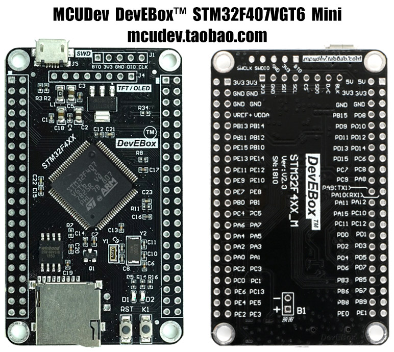

# Пример использования Segger Flash Loader

Пример прошивки внешней флеш памяти при помощи [Segger Flash Loader](https://wiki.segger.com/SEGGER_Flash_Loader). В данном примере используется плата [MCUDev DevEBox STM32F407VGT6](https://github.com/mcauser/MCUDEV_DEVEBOX_F407VGT6)



На плате установлена flash память [W25Q16](./doc/w25q16jv%20spi%20revd%2008122016.pdf). Память подключена к SPI1 (PB3 SCK, PB5 MOSI, PB4 MISO, PA15 CS).

Для прошивки flash памяти используется технология загружаемого в RAM микроконтроллера кода, который взаимодействует с отладчиком (J-Link) и осуществляет все операции с памятью. 

Загрузчик должен соотвествовать несколкимтребованиям:

* Должны быть реализованы несколько обязательных функций (SEGGER_FL_Prepare(), SEGGER_FL_Restore(), SEGGER_FL_Program(), SEGGER_FL_Erase()). Для памяти, которая не отображается в адресное пространство МК надо так же реализовать SEGGER_FL_Read()
* Должна присутствовать структура struct FlashDevice с описанием используемой памяти
* Расположение секций в elf файле должно соответствовать схеме:

```
section PrgCode                     // Marks the start of the SFL. Must be the very first section
sections .text, .rodata, ...        // In any order
section PrgData                     // Marks the end of the code + rodata region (functions, const data, ...) and the start of the data region (static + global variables)
sections .textrw, .data, .fast, ... // In any order
section DevDscr                     // Marks the location of the <FlashDevice> structure variable and also the end of the loader. Must(!!!) be the very last section
```

После сборки прошивки, для использования загрузчика в JFlash надо создать xml файл с описанием. Полное описание доступно на странице [J-Link Device Support Kit](https://wiki.segger.com/J-Link_Device_Support_Kit). Файл с описанием надо расположить:

|Windows|C:\Users\<USER>\AppData\Roaming\SEGGER\JLinkDevices|
|Linux|$HOME/.config/SEGGER/JLinkDevices|

Пример файла находится в папке JFlash. В данном случае target назван F407WQ25, а Flash Bank - "SPI Flash". Из JFlash можно протестировать чтение, стирание и запись во флеш. В прошивки включены отладочные сообщения в RTT, их можно смотреть во время работы с флеш памятью через JLinkRTTViewer.

Кроме интерактивного режима, JFlash так же поддерживает работу из командной строки. Полное описание всех параметров в [J-Flash User guide](https://www.segger.com/downloads/flasher/UM08003). Пример загрузки файла во флеш из командной строки:

```
JFlash -openprj Jflash/stm32f407.jflash -production -exit
``

Путь к загружаемому файлу, адрес загрузки и остальные параметры указаны в проекте Jflash/stm32f407.jflash. Их так же можно указать в командной строке.